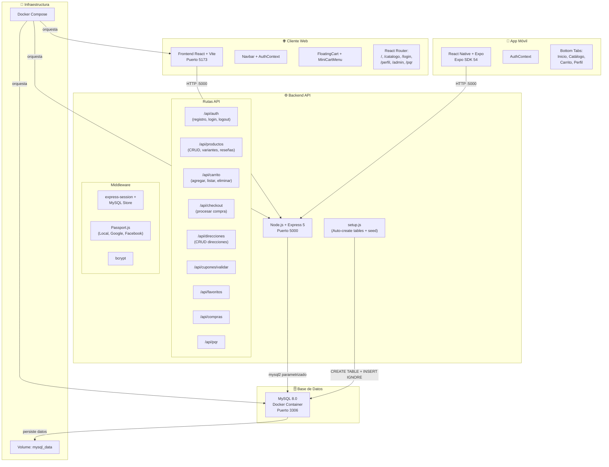
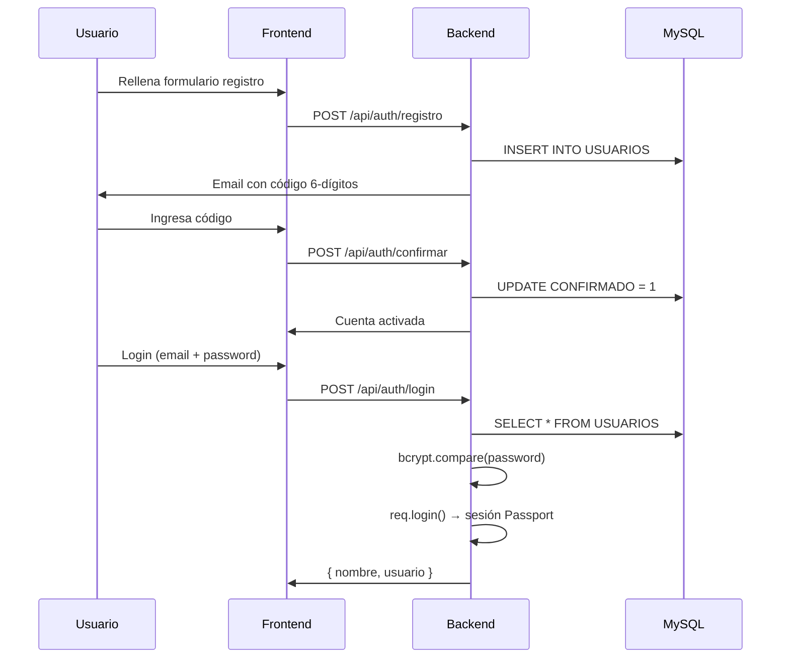
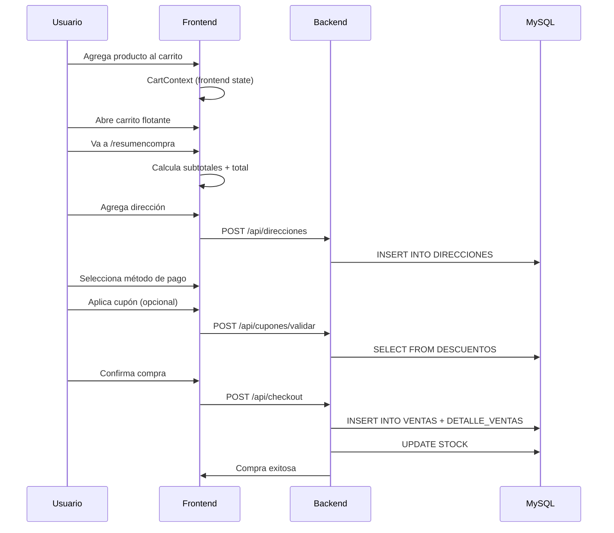

# Diagrama de Arquitectura — Jadda Sports

```mermaid
graph TB
    subgraph "🌐 Cliente Web"
        FRONTEND["Frontend React + Vite<br/>Puerto 5173"]
        NAVBAR["Navbar + AuthContext"]
        CART["FloatingCart + MiniCartMenu"]
        ROUTES["React Router:<br/>/, /catalogo, /login,<br/>/perfil, /admin, /pqr"]
    end

    subgraph "📱 App Móvil"
        MOBILE["React Native + Expo<br/>Expo SDK 54"]
        MOBILE_AUTH["AuthContext"]
        MOBILE_TABS["Bottom Tabs:<br/>Inicio, Catálogo,<br/>Carrito, Perfil"]
    end

    subgraph "⚙️ Backend API"
        BACKEND["Node.js + Express 5<br/>Puerto 5000"]
        SETUP["setup.js<br/>(Auto-create tables + seed)"]
        
        subgraph "Rutas API"
            AUTH["/api/auth<br/>(registro, login, logout)"]
            PRODUCTOS["/api/productos<br/>(CRUD, variantes, reseñas)"]
            CARRITO["/api/carrito<br/>(agregar, listar, eliminar)"]
            CHECKOUT["/api/checkout<br/>(procesar compra)"]
            DIRECCIONES["/api/direcciones<br/>(CRUD direcciones)"]
            CUPONES["/api/cupones/validar"]
            FAVORITOS["/api/favoritos"]
            COMPRAS["/api/compras"]
            PQR["/api/pqr"]
        end
        
        subgraph "Middleware"
            SESSION["express-session +<br/>MySQL Store"]
            PASSPORT["Passport.js<br/>(Local, Google, Facebook)"]
            BCRYPT["bcrypt"]
        end
    end

    subgraph "🗄️ Base de Datos"
        DB["MySQL 8.0<br/>Docker Container<br/>Puerto 3306"]
    end

    subgraph "🐳 Infraestructura"
        DOCKER["Docker Compose"]
        VOLUME["Volume: mysql_data"]
    end

    FRONTEND -->|"HTTP :5000"| BACKEND
    MOBILE -->|"HTTP :5000"| BACKEND
    BACKEND -->|"mysql2 parametrizado"| DB
    SETUP -->|"CREATE TABLE + INSERT IGNORE"| DB
    DOCKER -->|"orquesta"| FRONTEND
    DOCKER -->|"orquesta"| BACKEND
    DOCKER -->|"orquesta"| DB
    DB -->|"persiste datos"| VOLUME
```

## Flujo de Autenticación

```mermaid
sequenceDiagram
    participant U as Usuario
    participant F as Frontend
    participant B as Backend
    participant DB as MySQL

    U->>F: Rellena formulario registro
    F->>B: POST /api/auth/registro
    B->>DB: INSERT INTO USUARIOS
    B->>U: Email con código 6-dígitos
    U->>F: Ingresa código
    F->>B: POST /api/auth/confirmar
    B->>DB: UPDATE CONFIRMADO = 1
    B->>F: Cuenta activada
    U->>F: Login (email + password)
    F->>B: POST /api/auth/login
    B->>DB: SELECT * FROM USUARIOS
    B->>B: bcrypt.compare(password)
    B->>B: req.login() → sesión Passport
    B->>F: { nombre, usuario }
```

## Flujo de Compra

```mermaid
sequenceDiagram
    participant U as Usuario
    participant F as Frontend
    participant B as Backend
    participant DB as MySQL

    U->>F: Agrega producto al carrito
    F->>F: CartContext (frontend state)
    U->>F: Abre carrito flotante
    U->>F: Va a /resumencompra
    F->>F: Calcula subtotales + total
    U->>F: Agrega dirección
    F->>B: POST /api/direcciones
    B->>DB: INSERT INTO DIRECCIONES
    U->>F: Selecciona método de pago
    U->>F: Aplica cupón (opcional)
    F->>B: POST /api/cupones/validar
    B->>DB: SELECT FROM DESCUENTOS
    U->>F: Confirma compra
    F->>B: POST /api/checkout
    B->>DB: INSERT INTO VENTAS + DETALLE_VENTAS
    B->>DB: UPDATE STOCK
    B->>F: Compra exitosa
```
