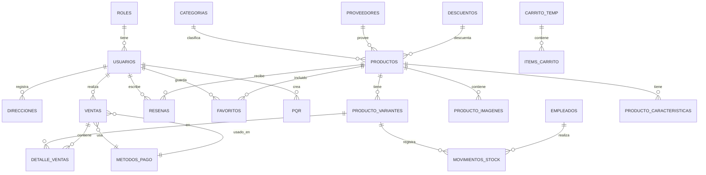

# Diagrama de Base de Datos — Jadda Sports

## Entidades y Relaciones

## Estructura de Tablas

### USUARIOS
| Columna | Tipo | Descripción |
|---------|------|-------------|
| ID_USUARIO | INT (PK) | Auto-incremental |
| NOMBRE_USUARIO | VARCHAR | Nombre del usuario |
| APELLIDO_USUARIO | VARCHAR | Apellido |
| EMAIL | VARCHAR (Unique) | Correo electrónico |
| USUARIO | VARCHAR | Nombre de usuario |
| CONTRASENA | VARCHAR | Hash bcrypt |
| ID_ROL | INT (FK) | Relación con ROLES |
| CONFIRMADO | TINYINT | Email verificado (1/0) |
| TOKEN | VARCHAR | Código 6-dígitos |
| TOKEN_EXPIRA | DATETIME | Expiración del token |
| TELEFONO | VARCHAR | Teléfono de contacto |
| FECHA_REGISTRO | DATETIME | Fecha de creación |
| FOTO_URL | VARCHAR | URL de avatar |
| TIPO_DOCUMENTO | VARCHAR | Tipo de identificación |
| NUMERO_DOCUMENTO | VARCHAR | Número de identificación |

### PRODUCTOS
| Columna | Tipo | Descripción |
|---------|------|-------------|
| ID_PRODUCTO | INT (PK) | Auto-incremental |
| NOMBRE | VARCHAR | Nombre del producto |
| PRECIO | DECIMAL(10,2) | Precio unitario |
| DESCRIPCION | TEXT | Descripción detallada |
| MARCA | VARCHAR | Marca del producto |
| ID_CATEGORIA | INT (FK) | Relación con CATEGORIAS |
| ID_PROVEEDOR | INT (FK) | Relación con PROVEEDORES |
| ID_DESCUENTO | INT (FK) | Relación con DESCUENTOS (opcional) |
| FECHA_CREACION | DATETIME | Fecha de alta |

### PRODUCTO_VARIANTES
| Columna | Tipo | Descripción |
|---------|------|-------------|
| ID_VARIANTE | INT (PK) | Auto-incremental |
| ID_PRODUCTO | INT (FK) | Producto padre |
| COLOR | VARCHAR | Color de la variante |
| TALLA | VARCHAR | Talla (S, M, L, XL, etc.) |
| STOCK | INT | Cantidad disponible |

### VENTAS
| Columna | Tipo | Descripción |
|---------|------|-------------|
| ID_VENTA | INT (PK) | Auto-incremental |
| ID_USUARIO | INT (FK) | Comprador |
| FECHA_VENTA | DATETIME | Fecha de la compra |
| TOTAL | DECIMAL(10,2) | Monto total |
| ESTADO | ENUM | COMPLETADA, PENDIENTE, CANCELADA |
| ESTADO_ENVIO | ENUM | PENDIENTE, ENVIADO, ENTREGADO, CANCELADO |
| ID_METODO_PAGO | INT (FK) | Método de pago usado |

### RESENAS
| Columna | Tipo | Descripción |
|---------|------|-------------|
| ID_RESENA | INT (PK) | Auto-incremental |
| ID_USUARIO | INT (FK) | Autor de la reseña |
| ID_PRODUCTO | INT (FK) | Producto reseñado |
| CALIFICACION | INT (1-5) | Puntuación en estrellas |
| COMENTARIO | TEXT | Texto de la reseña |
| FECHA | DATETIME | Fecha de creación |

### FAVORITOS
| Columna | Tipo | Descripción |
|---------|------|-------------|
| ID_FAVORITO | INT (PK) | Auto-incremental |
| ID_USUARIO | INT (FK) | Usuario que guarda |
| ID_PRODUCTO | INT (FK) | Producto guardado |
| FECHA_AGREGADO | DATETIME | Fecha de adición |

### PQR
| Columna | Tipo | Descripción |
|---------|------|-------------|
| ID_PQR | INT (PK) | Auto-incremental |
| ID_USUARIO | INT (FK) | Usuario solicitante |
| TIPO | ENUM | Petición, Queja, Reclamo, Sugerencia |
| ASUNTO | VARCHAR | Título del caso |
| DESCRIPCION | TEXT | Descripción detallada |
| NUMERO_PEDIDO | VARCHAR | Opcional |
| ESTADO | ENUM | PENDIENTE, RESUELTO |
| FECHA_CREACION | DATETIME | Fecha de apertura |

### Otras tablas (21 tablas total)
- **ROLES**: ID_ROL, NOMBRE_ROL
- **CATEGORIAS**: ID_CATEGORIA, NOMBRE, DESCRIPCION
- **PROVEEDORES**: ID_PROVEEDOR, NOMBRE, CONTACTO, TELEFONO, EMAIL
- **DESCUENTOS**: ID_DESCUENTO, CODIGO, PORCENTAJE, FECHA_INICIO, FECHA_FIN
- **PRODUCTO_IMAGENES**: ID_IMAGEN, ID_PRODUCTO, URL, ORDEN
- **PRODUCTO_CARACTERISTICAS**: ID_CARACTERISTICA, ID_PRODUCTO, NOMBRE, VALOR
- **DIRECCIONES**: ID_DIRECCION, ID_USUARIO, DIRECCION, CIUDAD, DEPARTAMENTO, BARRIO, TELEFONO_CONTACTO, CODIGO_POSTAL
- **DETALLE_VENTAS**: ID_DETALLE, ID_VENTA, ID_VARIANTE, CANTIDAD, PRECIO_UNITARIO
- **METODOS_PAGO**: ID_METODO, NOMBRE
- **MOVIMIENTOS_STOCK**: ID_MOVIMIENTO, ID_VARIANTE, ID_EMPLEADO, TIPO, CANTIDAD, FECHA
- **EMPLEADOS**: ID_EMPLEADO, ID_USUARIO, CARGO, FECHA_CONTRATACION, SALARIO
- **CARRITO_TEMP / ITEMS_CARRITO**: Carrito de compras temporal

> El esquema completo se define en `backend/database/setup.js` con 22 tablas y se crea automáticamente al iniciar el backend.
