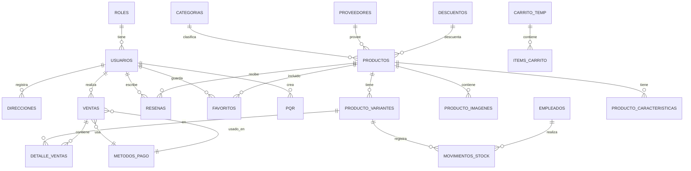

# Diagrama de Base de Datos — Jadda Sports

## Entidades y Relaciones

## Estructura de Tablas

### USUARIOS
| Columna | Tipo | Descripción |
|---------|------|-------------|
| ID_USUARIO | INT (PK) | Auto-incremental |
| NOMBRE_USUARIO | VARCHAR | Nombre del usuario |
| APELLIDO_USUARIO | VARCHAR | Apellido |
| EMAIL | VARCHAR (Unique) | Correo electrónico |
| USUARIO | VARCHAR | Nombre de usuario |
| CONTRASENA | VARCHAR | Hash bcrypt |
| ID_ROL | INT (FK) | Relación con ROLES |
| CONFIRMADO | TINYINT | Email verificado (1/0) |
| TOKEN | VARCHAR | Código 6-dígitos |
| TOKEN_EXPIRA | DATETIME | Expiración del token |
| TELEFONO | VARCHAR | Teléfono de contacto |
| FECHA_REGISTRO | DATETIME | Fecha de creación |
| FOTO_URL | VARCHAR | URL de avatar |
| TIPO_DOCUMENTO | VARCHAR | Tipo de identificación |
| NUMERO_DOCUMENTO | VARCHAR | Número de identificación |

### PRODUCTOS
| Columna | Tipo | Descripción |
|---------|------|-------------|
| ID_PRODUCTO | INT (PK) | Auto-incremental |
| NOMBRE | VARCHAR | Nombre del producto |
| PRECIO | DECIMAL(10,2) | Precio unitario |
| DESCRIPCION | TEXT | Descripción detallada |
| MARCA | VARCHAR | Marca del producto |
| ID_CATEGORIA | INT (FK) | Relación con CATEGORIAS |
| ID_PROVEEDOR | INT (FK) | Relación con PROVEEDORES |
| ID_DESCUENTO | INT (FK) | Relación con DESCUENTOS (opcional) |
| FECHA_CREACION | DATETIME | Fecha de alta |

### PRODUCTO_VARIANTES
| Columna | Tipo | Descripción |
|---------|------|-------------|
| ID_VARIANTE | INT (PK) | Auto-incremental |
| ID_PRODUCTO | INT (FK) | Producto padre |
| COLOR | VARCHAR | Color de la variante |
| TALLA | VARCHAR | Talla (S, M, L, XL, etc.) |
| STOCK | INT | Cantidad disponible |

### VENTAS
| Columna | Tipo | Descripción |
|---------|------|-------------|
| ID_VENTA | INT (PK) | Auto-incremental |
| ID_USUARIO | INT (FK) | Comprador |
| FECHA_VENTA | DATETIME | Fecha de la compra |
| TOTAL | DECIMAL(10,2) | Monto total |
| ESTADO | ENUM | COMPLETADA, PENDIENTE, CANCELADA |
| ESTADO_ENVIO | ENUM | PENDIENTE, ENVIADO, ENTREGADO, CANCELADO |
| ID_METODO_PAGO | INT (FK) | Método de pago usado |

### RESENAS
| Columna | Tipo | Descripción |
|---------|------|-------------|
| ID_RESENA | INT (PK) | Auto-incremental |
| ID_USUARIO | INT (FK) | Autor de la reseña |
| ID_PRODUCTO | INT (FK) | Producto reseñado |
| CALIFICACION | INT (1-5) | Puntuación en estrellas |
| COMENTARIO | TEXT | Texto de la reseña |
| FECHA | DATETIME | Fecha de creación |

### FAVORITOS
| Columna | Tipo | Descripción |
|---------|------|-------------|
| ID_FAVORITO | INT (PK) | Auto-incremental |
| ID_USUARIO | INT (FK) | Usuario que guarda |
| ID_PRODUCTO | INT (FK) | Producto guardado |
| FECHA_AGREGADO | DATETIME | Fecha de adición |

### PQR
| Columna | Tipo | Descripción |
|---------|------|-------------|
| ID_PQR | INT (PK) | Auto-incremental |
| ID_USUARIO | INT (FK) | Usuario solicitante |
| TIPO | ENUM | Petición, Queja, Reclamo, Sugerencia |
| ASUNTO | VARCHAR | Título del caso |
| DESCRIPCION | TEXT | Descripción detallada |
| NUMERO_PEDIDO | VARCHAR | Opcional |
| ESTADO | ENUM | PENDIENTE, RESUELTO |
| FECHA_CREACION | DATETIME | Fecha de apertura |

### Otras tablas
- **ROLES**: ID_ROL, NOMBRE_ROL, DESCRIPCION
- **CATEGORIAS**: ID_CATEGORIA, NOMBRE_CATEGORIA, DESCRIPCION
- **PROVEEDORES**: ID_PROVEEDOR, NOMBRE_PROVEEDOR, CONTACTO_PROVEEDOR, TELEFONO_PROVEEDOR, EMAIL_PROVEEDOR
- **DESCUENTOS**: ID_DESCUENTO, DESCRIPCION, PORCENTAJE, FECHA_INICIO, FECHA_FIN, USADO (cupones de un solo uso)
- **PRODUCTO_IMAGENES**: ID_IMAGEN, ID_PRODUCTO, URL_IMAGEN, ORDEN
- **PRODUCTO_CARACTERISTICAS**: ID_CARACTERISTICA, ID_PRODUCTO, NOMBRE_ATRIBUTO, VALOR_ATRIBUTO
- **DIRECCIONES**: ID_DIRECCION, ID_USUARIO, DIRECCION, CIUDAD, DEPARTAMENTO, BARRIO, TELEFONO_CONTACTO, CODIGO_POSTAL, ETIQUETA, ES_PRINCIPAL
- **DETALLE_VENTAS**: ID_DETALLE, ID_VENTA, ID_PRODUCTO, CANTIDAD, PRECIO_UNITARIO, SUBTOTAL
- **METODOS_PAGO**: ID_METODO, NOMBRE_METODO, DESCRIPCION
- **MOVIMIENTOS_STOCK**: ID_MOVIMIENTO, ID_PRODUCTO, TIPO_MOVIMIENTO, CANTIDAD, FECHA
- **EMPLEADOS**: ID_EMPLEADO, NOMBRE_EMPLEADO, APELLIDO_EMPLEADO, CARGO, FECHA_CONTRATACION, TELEFONO, EMAIL
- **INVENTARIO**: ID_INVENTARIO, ID_PRODUCTO, CANTIDAD, FECHA_INGRESO, FECHA_ACTUALIZACION
- **HISTORIAL**: ID_HISTORIAL, ID_USUARIO, ID_PRODUCTO, FECHA_VISTO
- **CARRITO**: ID_CARRITO, ID_USUARIO, ID_PRODUCTO, ID_VARIANTE, CANTIDAD, FECHA_AGREGADO
- **ENVIOS**: ID_ENVIO, ID_VENTA, DIRECCION_ENVIO, CIUDAD, DEPARTAMENTO, COSTO_ENVIO, ESTADO_ENVIO, FECHA_ENVIO
- **SESIONES** (`sessions`): session_id, expires, data (store de express-session)
- **RETOS**: ID_RETO, TITULO, DESCRIPCION, META_TIPO, META_VALOR, RECOMPENSA_PORCENTAJE, FECHA_INICIO, FECHA_FIN, ACTIVO
- **RETOS_USUARIOS**: ID_RETO_USUARIO, ID_RETO, ID_USUARIO, PROGRESO, COMPLETADO, CUPON_GENERADO
- **RETO_EVIDENCIAS**: ID_EVIDENCIA, ID_RETO_USUARIO, ID_USUARIO, TIPO (imagen|video), RUTA, RUTAS_EXTRA, CANTIDAD, ESTADO, FECHA_SUBIDA
- **NOTIFICACIONES**: ID_NOTIFICACION, ID_USUARIO (NULL = admin), TIPO, TITULO, MENSAJE, RUTA, LEIDA, FECHA
- **AVISOS_STOCK**: ID_AVISO, ID_VARIANTE, ID_USUARIO, FECHA_CREACION, ENVIADO (alertas de reposición, RF-035)
- **DEVOLUCIONES**: ID_DEVOLUCION, ID_USUARIO, ID_VENTA, ID_PRODUCTO, CANTIDAD, MOTIVO, ESTADO (SOLICITADA|APROBADA|RECHAZADA), FECHA_CREACION, FECHA_PROCESADA (solicitudes de devolución, RF-033)
- **PLANTILLAS_PLANES**: ID_PLANTILLA, ID_CATEGORIA, TITULO, DESCRIPCION, DURACION_DIAS, NIVEL, CONTENIDO (JSON)
- **PLANES_USUARIO**: ID_PLAN, ID_USUARIO, ID_VENTA, ID_PLANTILLA, FECHA_INICIO, COMPLETADO
- **USUARIOS_METODOS_PAGO**: ID, ID_USUARIO, ID_METODO, TITULAR, TELEFONO, BANCO, TIPO, ES_PRINCIPAL, FECHA_CREADO

> El esquema completo se define en `backend/database/setup.js` con 32 tablas en el bloque principal + `DEVOLUCIONES` (creada por migración sobre bases existentes) = **33 tablas**, y se crea automáticamente al iniciar el backend (CREATE TABLE IF NOT EXISTS + migraciones idempotentes). Para bases nuevas existe `backend/database/schema.sql` (generado desde setup.js con `node backend/database/exportarSchema.js`), importable en MySQL Workbench. `CATEGORIAS.NOMBRE_CATEGORIA` tiene índice único (`uq_categoria_nombre`).
