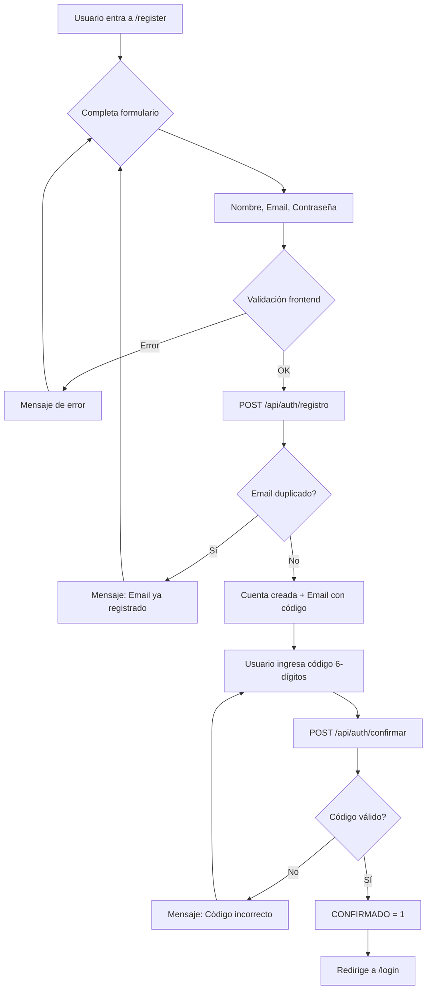
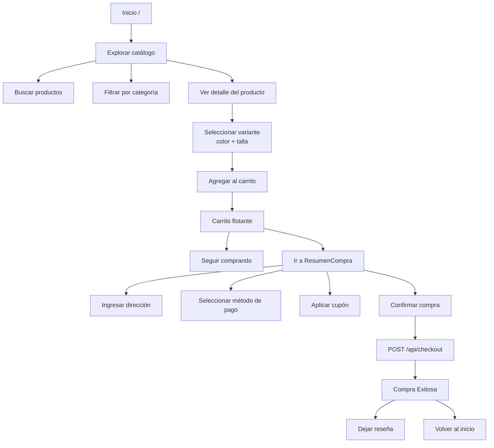
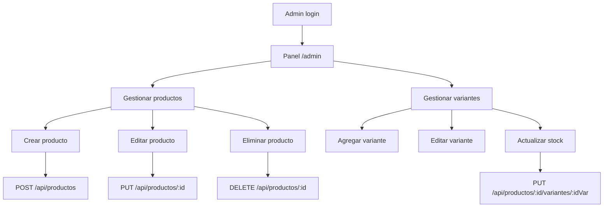
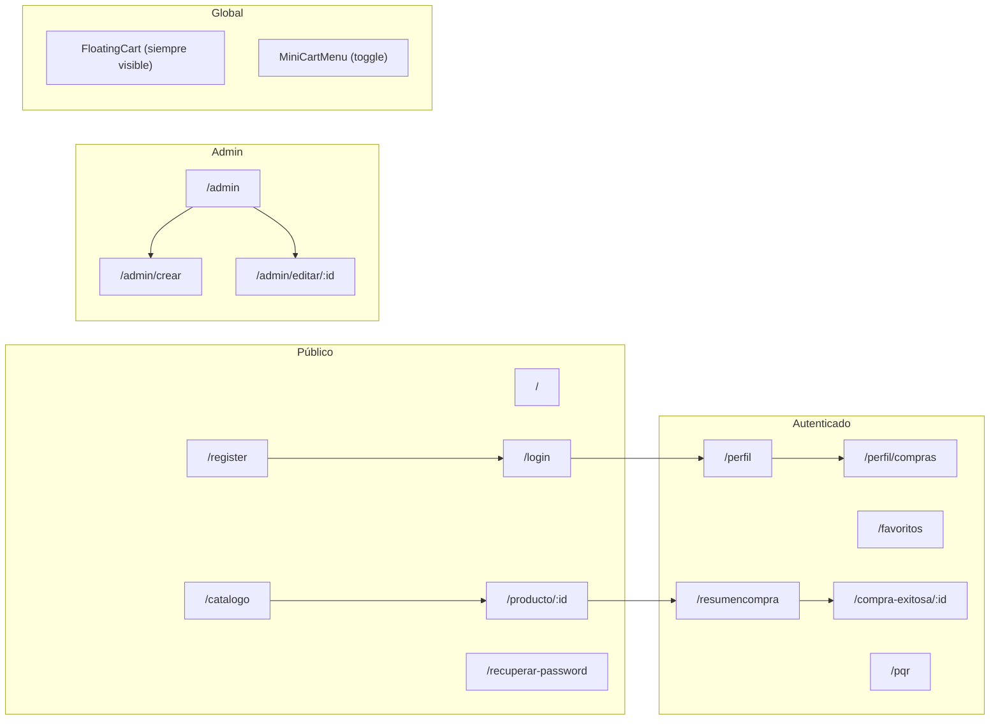

# Flujos de Usuario — Jadda Sports

## 1. Registro y Verificación

```mermaid
flowchart TD
    A[Usuario entra a /register] --> B{Completa formulario}
    B --> C[Nombre, Email, Contraseña]
    C --> D{Validación frontend}
    D -->|Error| E[Mensaje de error]
    E --> B
    D -->|OK| F[POST /api/auth/registro]
    F --> G{Email duplicado?}
    G -->|Sí| H[Mensaje: Email ya registrado]
    H --> B
    G -->|No| I[Cuenta creada + Email con código]
    I --> J[Usuario ingresa código 6-dígitos]
    J --> K[POST /api/auth/confirmar]
    K --> L{Código válido?}
    L -->|No| M[Mensaje: Código incorrecto]
    M --> J
    L -->|Sí| N[CONFIRMADO = 1]
    N --> O[Redirige a /login]
```

## 2. Navegación y Compra

```mermaid
flowchart TD
    A[Inicio /] --> B[Explorar catálogo]
    B --> C[Buscar productos]
    B --> D[Filtrar por categoría]
    B --> E[Ver detalle del producto]
    E --> F[Seleccionar variante<br/>color + talla]
    F --> G[Agregar al carrito]
    G --> H[Carrito flotante]
    H --> I[Seguir comprando]
    H --> J[Ir a ResumenCompra]
    J --> K[Ingresar dirección]
    J --> L[Seleccionar método de pago]
    J --> M[Aplicar cupón]
    J --> N[Confirmar compra]
    N --> O[POST /api/checkout]
    O --> P[Compra Exitosa]
    P --> Q[Dejar reseña]
    P --> R[Volver al inicio]
```

## 3. Panel Administrador

```mermaid
flowchart TD
    A[Admin login] --> B[Panel /admin]
    B --> C[Gestionar productos]
    B --> D[Gestionar variantes]
    
    C --> C1[Crear producto]
    C --> C2[Editar producto]
    C --> C3[Eliminar producto]
    
    D --> D1[Agregar variante]
    D --> D2[Editar variante]
    D --> D3[Actualizar stock]
    
    C1 --> E[POST /api/productos]
    C2 --> F[PUT /api/productos/:id]
    C3 --> G[DELETE /api/productos/:id]
    D3 --> H[PUT /api/productos/:id/variantes/:idVar]
```

## 4. Mapa de Navegación (Frontend)

```mermaid
flowchart LR
    subgraph "Público"
        HOME["/"]
        CATALOGO["/catalogo"]
        DETALLE["/producto/:id"]
        LOGIN["/login"]
        REGISTER["/register"]
        RECUPERAR["/recuperar-password"]
    end
    
    subgraph "Autenticado"
        PERFIL["/perfil"]
        COMPRAS["/perfil/compras"]
        FAVORITOS["/favoritos"]
        RESUMEN["/resumencompra"]
        EXITO["/compra-exitosa/:id"]
        PQR["/pqr"]
    end
    
    subgraph "Admin"
        ADMIN["/admin"]
        CREAR["/admin/crear"]
        EDITAR["/admin/editar/:id"]
    end

    subgraph "Global"
        FLOATING["FloatingCart (siempre visible)"]
        MINI_CART["MiniCartMenu (toggle)"]
    end

    LOGIN --> PERFIL
    REGISTER --> LOGIN
    CATALOGO --> DETALLE
    DETALLE --> RESUMEN
    RESUMEN --> EXITO
    PERFIL --> COMPRAS
    ADMIN --> CREAR
    ADMIN --> EDITAR
```
